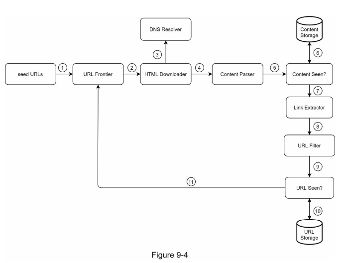

### Simple Web Crawler

## Inspiration from System Design Interview - Alex Xu

Functional Requirements:
- Given a set of URLs, download (or visit) all web pages addressed by the URLS
- Extract URLS from these web pages
- Add new URLS to the list of URLS to be downloaded
Repeat

Nonfunctional Requirements:
- HTML only
- duplicate URLS should be ignored
- politeness ............... probably not

Design Deep Dive:
- BFS since DFS can get too deep
- URL Frontier like a queue with priority and partition tolerance to handle politeness, can expand on this later
- Avoiding duplicate URLS

Design:
- cmd/main.go will have a .Run() that delegates to frontier
- frontier .Run() will crawl() but this is algorithm dependent, i.e should be a strategy since user passes in how they want to do it
- the crawls should be done at another level since how it crawls is different than how we visit urls,
actual crawling process is just visit (dedupe + download) -> extract -> put back on queue